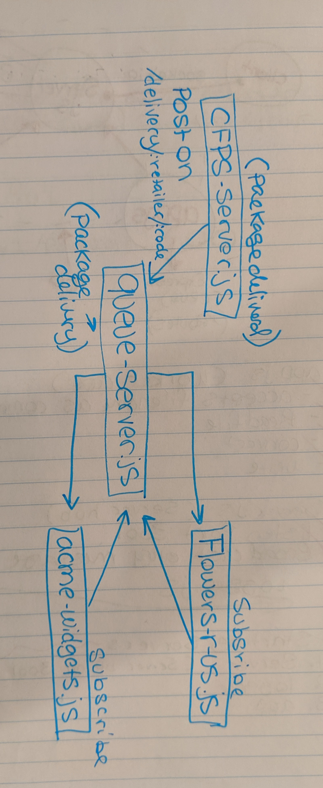

# Lab - 19

## Message Queues

### Author: Natalie Alway

### Links and Resources
* [submission PR](https://github.com/nataliealway-401-advanced-javascript/lab-19-message-queues/pull/1)
* [travis](https://www.travis-ci.com/nataliealway-401-advanced-javascript/lab-19-message-queues)

### Documentation
* [jsdocs](https://github.com/nataliealway-401-advanced-javascript/lab-19-message-queues/tree/lab19/docs)

### Setup
#### How to initialize/run your server app:
* `npm start`

  
#### Tests
* Unit Tests: `npm test`
* Lint Tests: `npm run lint`

#### UML

